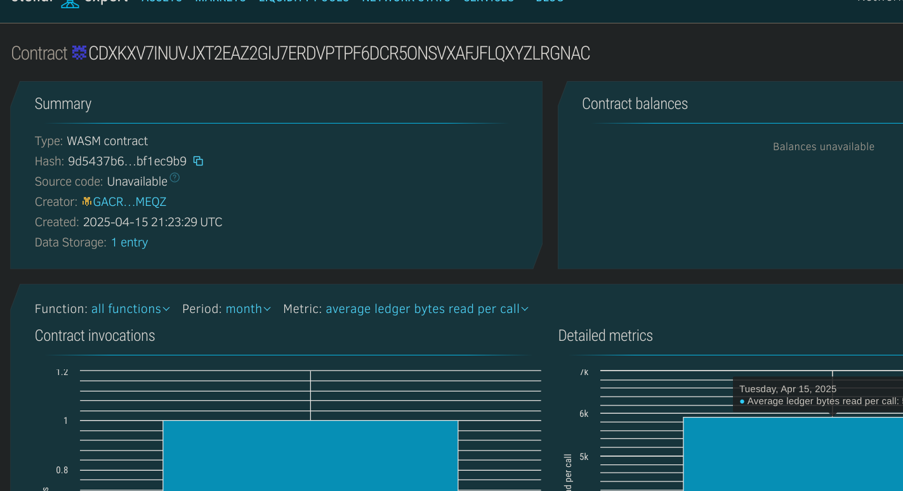

# Donation Tracker

## Project Title
Donation Tracker - A transparent blockchain-based donation management system built on Stellar's Soroban smart contract platform.

## Project Description
Donation Tracker is a decentralized application (dApp) designed to bring transparency and accountability to charitable giving and fundraising campaigns. Built on Stellar's Soroban platform, this system enables the creation of fundraising campaigns and facilitates transparent tracking of all donations made to these campaigns.

The platform allows campaign organizers to create fundraising initiatives with specific goals, descriptions, and target amounts. Donors can contribute to these campaigns with cryptocurrency, optionally including personal messages with their donations. All transactions are permanently recorded on the blockchain, ensuring complete transparency in how funds are raised and distributed.

By leveraging blockchain technology, Donation Tracker eliminates the opacity that often surrounds traditional charitable giving. Donors can verify exactly how much has been contributed to a campaign, and organizers can build trust through transparent fund management. This transparency helps combat fraud in the charitable sector while fostering greater trust between donors and the causes they support.

## Project Vision
The vision for Donation Tracker is to revolutionize charitable giving by creating an ecosystem where transparency is the foundation of trust. We aim to:

1. Eliminate uncertainty about how donations are used by providing complete visibility into all transactions
2. Reduce fraud in charitable giving through immutable record-keeping on the blockchain
3. Lower administrative costs associated with donation management, allowing more funds to reach their intended causes
4. Provide global access to fundraising tools, enabling causes from anywhere in the world to receive support
5. Create direct connections between donors and recipients without unnecessary intermediaries
6. Enable real-time tracking of campaign progress toward goals
7. Foster a culture of accountability in nonprofit and charitable organizations
8. Bridge the trust gap that often prevents potential donors from contributing to worthy causes

By achieving these objectives, Donation Tracker will help transform the charitable giving landscape, making it more efficient, accessible, and trustworthy for both donors and organizations.

## Key Features

### Current Features:
- **Campaign Creation**: Easy setup of fundraising campaigns with detailed information
- **Transparent Donation Records**: All contributions permanently recorded on the blockchain
- **Campaign Statistics**: Real-time tracking of amounts raised and donor counts
- **Message Support**: Personal messages can accompany donations
- **Goal Tracking**: Visual representation of progress toward fundraising goals
- **Timestamp Verification**: All activities chronologically recorded for accountability
- **Campaign Status Management**: Campaigns can be marked active or inactive
- **Organizer Identification**: Clear attribution of campaign ownership

### Technical Implementation:
- Built on Stellar's Soroban smart contract platform
- Written in Rust for performance and security
- Stateful contract design for maintaining campaign and donation records
- Structured data storage for efficient retrieval and management
- Address-based authentication for secure access control
- Time-stamped transactions for chronological integrity

## Future Scope

### Short-term Roadmap:
- **Multi-Currency Support**: Accept various cryptocurrencies and stablecoins
- **Withdrawal Mechanisms**: Secure processes for campaign organizers to access funds
- **Campaign Updates**: Allow organizers to post progress updates visible to donors
- **Donor Dashboards**: Personalized views of all donations made by an individual
- **Campaign Categories**: Organization of fundraisers by cause or purpose
- **Featured Campaigns**: Highlighting urgent or high-impact fundraising efforts
- **Social Sharing**: Easy sharing of campaigns across social media platforms
- **Recurring Donations**: Support for regular, scheduled contributions

### Long-term Vision:
- **Milestone-Based Funding**: Release of funds upon reaching predefined project milestones
- **Verification System**: Validation of campaign organizers' identities and credibility
- **Impact Tracking**: Measurement and reporting of the real-world impact of donations
- **Donor Communities**: Formation of groups with shared charitable interests
- **Matching Funds**: Smart contract implementation of donation matching programs
- **Tax Documentation**: Automated generation of tax receipts for donations
- **Campaign Templates**: Predefined structures for common fundraising needs
- **Cross-Chain Compatibility**: Expansion to other blockchain ecosystems
- **DAO Governance**: Community oversight of platform development and policies
- **Beneficiary Confirmation**: Verification of fund receipt by intended recipients
- **Advanced Analytics**: Deeper insights into giving patterns and campaign effectiveness
- **Decentralized Escrow**: Third-party validation of fund usage for large campaigns

## Contract Details:
CDXKXV7INUVJXT2EAZ2GIJ7ERDVPTPF6DCR5ONSVXAFJFLQXYZLRGNAC
